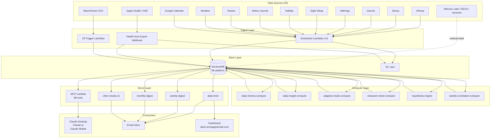
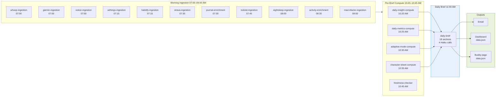
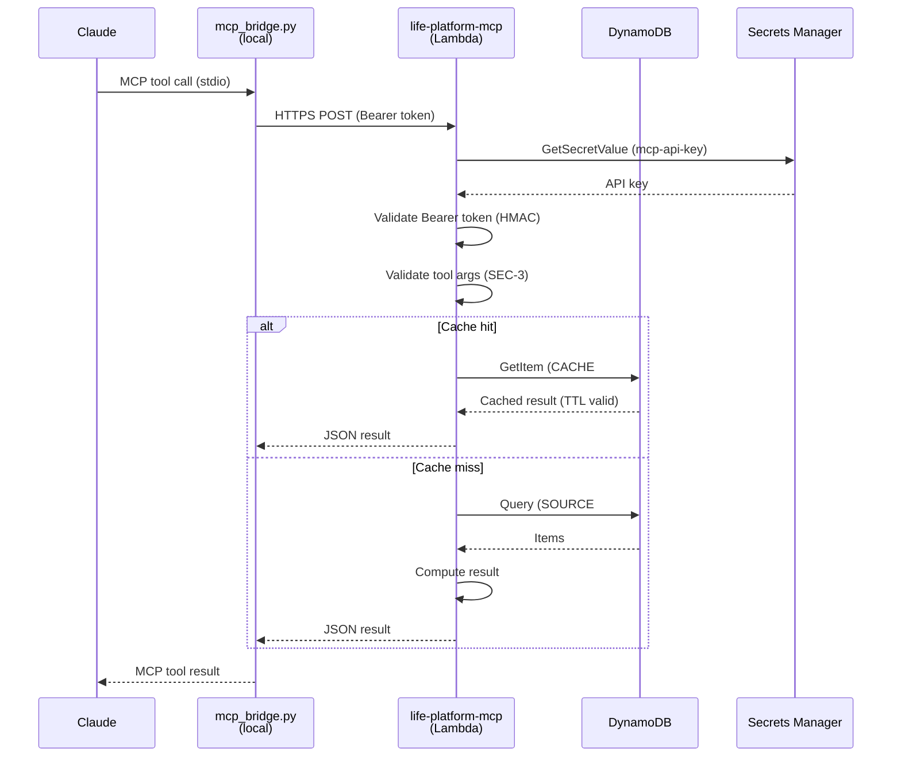
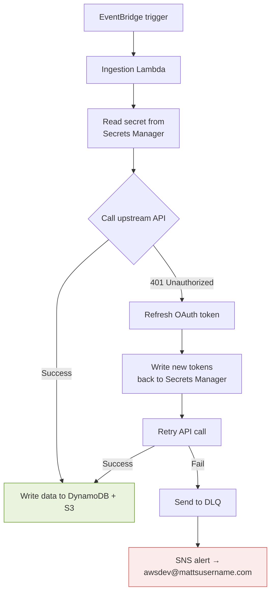

# Data Flow Diagrams

> Mermaid diagrams for the full ingestion, compute, and serve pipelines.
> Render in GitHub, VS Code (Mermaid plugin), or at https://mermaid.live
> Last updated: 2026-03-15 (v3.7.30)

---

## 1. Full System Overview



---

## 2. Daily Brief Pipeline (Critical Path)

Times are PDT. Each step must complete before the next begins.



---

## 3. DynamoDB Key Schema

```mermaid
erDiagram
    ITEM {
        string pk "USER#matthew#SOURCE#whoop"
        string sk "DATE#2026-03-15"
        string date "2026-03-15"
        number recovery_score "84"
        number hrv "42.1"
        number resting_heart_rate "48"
        string schema_version "1.0"
    }

    CACHE_ITEM {
        string pk "CACHE#matthew"
        string sk "TOOL#get_health_dashboard"
        string payload "JSON string"
        number ttl "epoch + 26h"
        string computed_at "ISO timestamp"
    }

    PROFILE {
        string pk "USER#matthew"
        string sk "PROFILE#v1"
        object targets "weight, macros, etc."
        object source_of_truth "domain -> source"
    }

    ITEM ||--o{ CACHE_ITEM : "pre-computed from"
    PROFILE ||--o{ ITEM : "configures queries for"
```

---

## 4. MCP Request Flow



---

## 5. OAuth Token Refresh Flow

All OAuth sources (Whoop, Strava, Withings, Garmin) use this self-healing pattern:



**Withings note:** Withings rotates its refresh token on every use. If the Lambda is down for >24h, the token expires and auto-refresh breaks. Re-authenticate with `python3 setup/fix_withings_oauth.py`.

---

## 6. Weekly Email Cadence

```mermaid
gantt
    title Weekly Intelligence Cadence (PDT)
    dateFormat  HH:mm
    axisFormat  %a %H:%M

    section Monday
    monday-compass           :08:00, 30m

    section Daily (all days)
    anomaly-detector         :09:05, 15m
    daily-brief              :11:00, 20m

    section Wednesday
    wednesday-chronicle      :08:00, 30m

    section Friday
    weekly-plate             :19:00, 20m

    section Saturday
    nutrition-review         :10:00, 45m

    section Sunday
    weekly-digest            :09:00, 30m
    hypothesis-engine        :12:00, 45m
```



---

## 7. Alarm Coverage

```mermaid
flowchart LR
    subgraph Lambdas["Lambda Errors (~42 functions)"]
        EACH[Each Lambda has\n≥1 error alarm\n→ SNS]
    end

    subgraph Special["Special Alarms"]
        WI_OAUTH[withings-oauth-consecutive-errors\n2 consecutive days]
        DB_NI[daily-brief-no-invocations\n24h window]
        DB_DUR[daily-brief-duration-high\n>240s]
        MCP_DUR[mcp-server-duration-high\n>240s]
        MCP_AUTH[MCP AuthFailures\n≥5 in 5min]
        COMPUTE[compute-pipeline-stale\ndaily-metrics not fresh]
        CANARY[canary errors\nevery 30min]
        FRESH[freshness-checker errors]
    end

    subgraph Action["Alert Action"]
        SNS[SNS: life-platform-alerts]
        EMAIL[awsdev@mattsusername.com]
    end

    EACH --> SNS
    Special --> SNS
    SNS --> EMAIL
```

Total alarms: ~49. All route to `life-platform-alerts` SNS → email.
